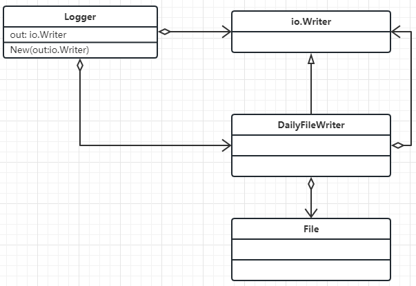

# Crisp
**简介：** ***Golang 长链接 轻量级 单线程 游戏服务器 回合制***
***
**Crisp**是基于Golang开发的长链接游戏服务器框架，整个服务器的架构为单线程：  
1. 在单线程架构的基础上，通过封装保证了开发人员在实际编程中无需时刻注意当前逻辑所处的线程，最大可能避免了游戏中较为高频出现的跨线程BUG。  
2. 框架主攻方向为回合制游戏（如棋牌休闲等游戏），将会提供游戏业务中常用的各种模块，让你快速搭建并实现基本的长链接游戏服务器。  
3. Crisp目前在本地已经实现了单服务的版本，压测达到每秒可处理的请求数为1000个以上。  
4. 集成Etcd的分布式集群版本目前正在开发当中。  
***
**整体架构**

**Log**
